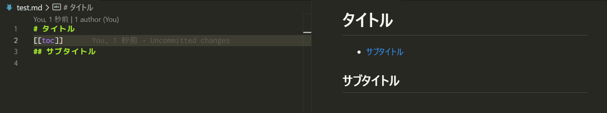
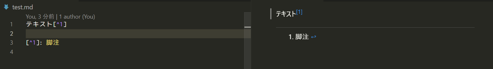
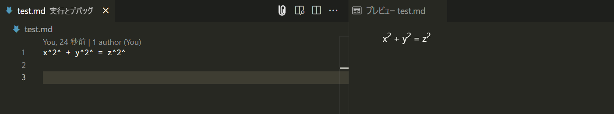
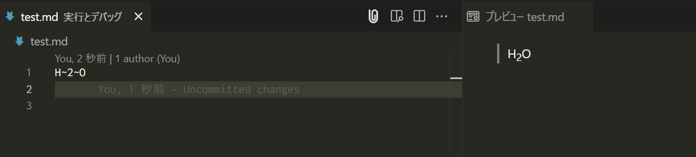
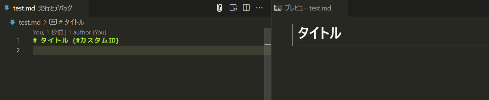
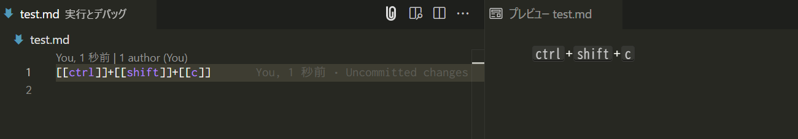
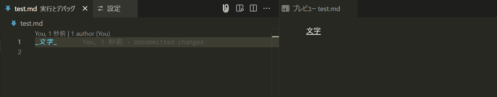
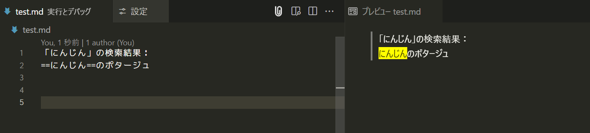
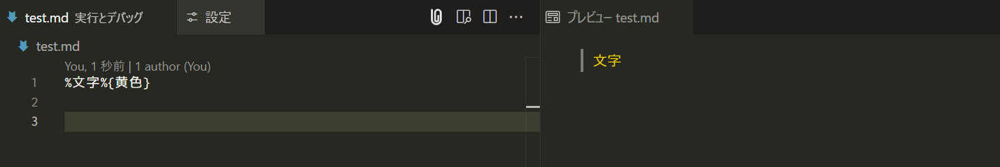

# Markdown Box

便利なMarkdown用プラグインを一括導入できるVSCode拡張機能です。この拡張機能をインストールするだけで、Markdownの編集や表示に役立つ様々な機能を利用できるようになります。

<!-- omit in toc -->
## 目次
- [インストール](#インストール)
- [プラグイン](#プラグイン)
- [設定オプション](#設定オプション)
- [クレジット](#クレジット)
- [謝辞](#謝辞)

## インストール
VScodeのマーケットプレイスで「**Markdown Box**」と入力してください｡

## プラグイン

「Markdown Box」をインストールすることで、下記のプラグインが使用可能となります。各プラグインは設定でON/OFFの切り替えのほか、独自のコンフィグを設定することも可能です。

| プラグイン                                                                                   | 入力                       | レンダリング                                           | 説明                       | 
| -------------------------------------------------------------------------------------------- | -------------------------- | ------------------------------------------------------ | -------------------------- | 
| [markdown-it-table-of-contents](https://www.npmjs.com/package/markdown-it-table-of-contents) | `[[toc]]`                  |  | 目次生成                   | 
| [markdown-it-footnote](https://www.npmjs.com/package/markdown-it-footnote)                   | `[^1]`                     |           | 脚注生成                   | 
| [markdown-it-sup](https://www.npmjs.com/package/markdown-it-sup)                             | `x^2^ + y^2^ = z^2^`       |                | 上付き文字生成             | 
| [markdown-it-sub](https://www.npmjs.com/package/markdown-it-sub)                             | `H~2~O`                    |                | 下付き文字生成             | 
| [markdown-it-attrs](https://www.npmjs.com/package/markdown-it-attrs)                         | `# タイトル {#カスタムID}` |              | {}部分を削除する           | 
| [markdown-it-kbd](https://www.npmjs.com/package/markdown-it-kbd)                             | `[[ctrl]]+[[shift]]+[[c]]` |                | キーボードを表現する       | 
| [markdown-it-underline](https://www.npmjs.com/package/markdown-it-underline)                 | `_文字_`                   |          | 下線部を表現する           | 
| [markdown-it-mark](https://www.npmjs.com/package/markdown-it-mark)                           | `==文字==`                 |               | 文脈上重要な箇所を強調する | 
| [markdown-it-mojicolor](https://www.npmjs.com/package/markdown-it-mojicolor)                 | `%文字%{色}`               |          | 文字色を指定する           | 

### markdown-it-table-of-contents

`[[toc]]`と書いた箇所に、自動生成された目次をレンダリングするプラグインです。

：  [markdown-it-table-of-contents](https://www.npmjs.com/package/markdown-it-table-of-contents)

### markdown-it-footnote

`テキスト[^1]`及び`[^1]: 脚注`とセットで書くと、文章下部に脚注が出現します。

： [markdown-it-footnote](https://www.npmjs.com/package/markdown-it-footnote) 

### markdown-it-sup

supは「**Superscript（上付き文字）**」の略です。`x^2^`のように`^`で囲むと、`x2`のように``タグで囲まれてレンダリングされます。

： [markdown-it-sup](https://www.npmjs.com/package/markdown-it-sup)

### markdown-it-sub

subは「**Subscript（下付き文字）**」の略です。`H~2~O`のように`~`で囲むと`H2O`のように``タグで囲われてレンダリングされます。

 ： [markdown-it-sub](https://www.npmjs.com/package/markdown-it-sub) 

### markdown-it-attrs

`# タイトル{#カスタムID}`とすると、レビューから`{#カスタムID}`部分は削除されます。また、`<h1 id="カスタムID">タイトル</h1>`のようにIDが付与されてレンダリングされます。

： [markdown-it-attrs](https://www.npmjs.com/package/markdown-it-attrs)

### markdown-it-kbd

kbdは「**keyboard（キーボード）**」の略です。`[[ctrl]]+[[shift]]+[[c]]`のように各文字を`[[]]`で囲むと、`<kbd>ctrl</kbd>+<kbd>shift</kbd>+<kbd>c</kbd>`のように`<kbd>`で囲われてレンダリングされます。

： [markdown-it-kbd](https://www.npmjs.com/package/markdown-it-kbd) 

### markdown-it-underline

`_文字_`とすることで`<u>underline</u>`でレンダリングできるプラグインです。`<u>`は以前は単なる下線を引くタグでしたが、HTML5で役割が変更されました。主にスペルミスや綴りの誤りを指摘する用途に使います。

ちなみにこのプラグインを導入しない場合、`_文字_`は`<em>文字</em>`でレンダリングされます。`<em>`は「**強調（emphasis）**」を表現するためのタグです。

： [markdown-it-underline](https://www.npmjs.com/package/markdown-it-underline) 

### markdown-it-mark

`==文字==`とすることで`<mark>文字</mark>`でレンダリングされるプラグインです。`<mark>`は検索結果を表示する際など、文脈上重要な箇所を強調するために使うタグです。

： [markdown-it-mark](https://www.npmjs.com/package/markdown-it-mark)  

### markdown-it-mojicolor

`%文字%{黄色}`とすることで、`文字`のように指定した色がレンダリングされるプラグインです。

： [markdown-it-mojicolor](https://www.npmjs.com/package/markdown-it-mojicolor)  

## 設定オプション

markdown-boxには2つの設定があります。

### 1. プラグインのON/OFF機能
- `Markdown-box > Markdown-it-〇〇: Enable`（デフォルト: true）
  - **true（チェック）** : プラグインが有効となり、Markdownプレビューに反映されます
  - **false（チェックを外す）** : プラグインは無効になり、Markdownプレビューに反映されなくなります

### 2. プラグインのオプション設定機能
- `Markdown-box > Markdown-it-〇〇: Options`（デフォルト: 各プラグインで異なります）
  - **settings.json で編集** : 各プラグインの詳細設定を編集できます

各プラグインを独自の設定にしたい場合は`settings.json で編集`をクリックします。

## クレジット
VScode拡張機能で表示されるアイコンは、以下の2つの画像を組み合わせたものです。

| 画像                                                                                                                                                                                          | ライセンス                                                      | 作者/サイト                                                                                                     | 
| --------------------------------------------------------------------------------------------------------------------------------------------------------------------------------------------- | --------------------------------------------------------------- | --------------------------------------------------------------------------------------------------------------- | 
| [Free Markdown Icon](https://iconscout.com/free-icon/markdown-1)                                                                                                                                  | [MIT ライセンス](https://opensource.org/license/MIT)            | [Benjamin J sperry](https://iconscout.com/contributors/benjamin-j-sperry) / [IconScout](https://iconscout.com/) | 
| [段ボール箱　11](https://icooon-mono.com/12408-%e6%ae%b5%e3%83%9c%e3%83%bc%e3%83%ab%e7%ae%b1-11/)| [icooon-mono独自のライセンス](https://icooon-mono.com/license/) | [icooon-mono](https://icooon-mono.com/)    

## 謝辞
このプロジェクトの開発にあたり、以下のオープンソースソフトウェアを参考にさせていただきました。この場を借りて感謝の意を表します。

- [qjebbs/vscode-markdown-extended](https://github.com/qjebbs/vscode-markdown-extended)
